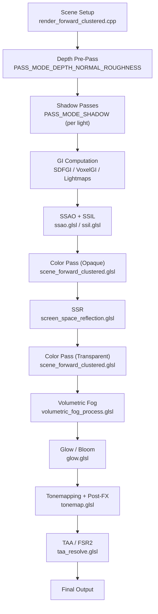

# Godot Engine Rendering Pipeline — Complete Analysis

## Engine Overview

The Zlendo render engine is built on a **modified Godot 4.x** using the **Forward+ (Clustered) renderer** backed by **Vulkan/RenderingDevice**. The entire pipeline runs through GLSL compute/raster shaders orchestrated by C++ code in `renderer_rd/`.

---

## Frame Execution Flow



---

## Critical Source Files Map

### 🔴 Highest Impact — PBR Lighting & Shadows

| File | Path | Lines | Role |
|------|------|-------|------|
| **scene_forward_clustered.glsl** | [scene_forward_clustered.glsl](file:///c:/Zlendo2026/ZlendoRenderEngine%20-%20stage4.6/godot/servers/rendering/renderer_rd/shaders/forward_clustered/scene_forward_clustered.glsl) | 3009 | **Main PBR shader** — vertex + fragment. Handles material evaluation, GI integration, lighting accumulation, fog, shadow sampling, and final compositing |
| **scene_forward_lights_inc.glsl** | [scene_forward_lights_inc.glsl](file:///c:/Zlendo2026/ZlendoRenderEngine%20-%20stage4.6/godot/servers/rendering/renderer_rd/shaders/scene_forward_lights_inc.glsl) | 1025 | **Light computation** — D_GGX, V_GGX, Schlick Fresnel, Burley diffuse, PCF shadow sampling, PCSS soft shadows, omni/spot/directional light processing |
| **scene_forward_gi_inc.glsl** | [scene_forward_gi_inc.glsl](file:///c:/Zlendo2026/ZlendoRenderEngine%20-%20stage4.6/godot/servers/rendering/renderer_rd/shaders/scene_forward_gi_inc.glsl) | ~300 | SDFGI probe sampling, VoxelGI, reflection probe blending |
| **render_forward_clustered.cpp** | [render_forward_clustered.cpp](file:///c:/Zlendo2026/ZlendoRenderEngine%20-%20stage4.6/godot/servers/rendering/renderer_rd/forward_clustered/render_forward_clustered.cpp) | 5194 | **C++ orchestrator** — sets up environment UBO, dispatches all render passes, configures shadow maps, manages render buffers |

---

### 🟠 High Impact — Tonemapping & Post-Processing

| File | Path | Lines | Role |
|------|------|-------|------|
| **tonemap.glsl** | [tonemap.glsl](file:///c:/Zlendo2026/ZlendoRenderEngine%20-%20stage4.6/godot/servers/rendering/renderer_rd/shaders/effects/tonemap.glsl) | 961 | Tonemappers (Linear, Reinhard, Filmic, ACES, **AgX**), FXAA, glow application, BCS color grading, color correction LUT, 8-bit debanding |
| **taa_resolve.glsl** | [taa_resolve.glsl](file:///c:/Zlendo2026/ZlendoRenderEngine%20-%20stage4.6/godot/servers/rendering/renderer_rd/shaders/effects/taa_resolve.glsl) | ~500 | Temporal anti-aliasing resolve with neighborhood clamping |

---

### 🟡 Medium Impact — Screen-Space Effects

| File | Path | Lines | Role |
|------|------|-------|------|
| **ssao.glsl** | [ssao.glsl](file:///c:/Zlendo2026/ZlendoRenderEngine%20-%20stage4.6/godot/servers/rendering/renderer_rd/shaders/effects/ssao.glsl) | 482 | Intel SSAO (GTAO variant) — 32 sample disk, quality presets 0-4, depth mips, detail AO, edge-aware processing |
| **ssil.glsl** | [ssil.glsl](file:///c:/Zlendo2026/ZlendoRenderEngine%20-%20stage4.6/godot/servers/rendering/renderer_rd/shaders/effects/ssil.glsl) | ~450 | Screen-space indirect lighting — same architecture as SSAO but accumulates indirect bounce light |
| **screen_space_reflection.glsl** | [screen_space_reflection.glsl](file:///c:/Zlendo2026/ZlendoRenderEngine%20-%20stage4.6/godot/servers/rendering/renderer_rd/shaders/effects/screen_space_reflection.glsl) | ~400 | Hi-Z ray marching for SSR, roughness-based mip selection |

---

### 🟢 Environment & GI

| File | Path | Role |
|------|------|------|
| **gi.cpp** | [gi.cpp](file:///c:/Zlendo2026/ZlendoRenderEngine%20-%20stage4.6/godot/servers/rendering/renderer_rd/environment/gi.cpp) | SDFGI cascade management, VoxelGI baking, probe updates |
| **gi.glsl** | [gi.glsl](file:///c:/Zlendo2026/ZlendoRenderEngine%20-%20stage4.6/godot/servers/rendering/renderer_rd/shaders/environment/gi.glsl) | GI resolve compute shader — composites SDFGI + VoxelGI into ambient/reflection buffers |
| **sky.glsl** | [sky.glsl](file:///c:/Zlendo2026/ZlendoRenderEngine%20-%20stage4.6/godot/servers/rendering/renderer_rd/shaders/environment/sky.glsl) | Sky rendering, procedural sky, panoramic HDRI |
| **volumetric_fog_process.glsl** | [volumetric_fog_process.glsl](file:///c:/Zlendo2026/ZlendoRenderEngine%20-%20stage4.6/godot/servers/rendering/renderer_rd/shaders/environment/volumetric_fog_process.glsl) | Volumetric fog froxel computation |

---

## Key PBR Shader Analysis

### Specular Model (GGX/Schlick)

Located in [scene_forward_lights_inc.glsl](file:///c:/Zlendo2026/ZlendoRenderEngine%20-%20stage4.6/godot/servers/rendering/renderer_rd/shaders/scene_forward_lights_inc.glsl):

```glsl
// Line 16-26: GGX Normal Distribution Function
half D_GGX(half NoH, half roughness, hvec3 n, hvec3 h) {
    half a = NoH * roughness;
    float k = roughness / (1.0 - NoH * NoH + a * a);
    half d = k * k * half(1.0 / M_PI);
    return saturateHalf(d);
}

// Line 29-32: Smith GGX Visibility term (Hammon approximation)
half V_GGX(half NdotL, half NdotV, half alpha) {
    half v = half(0.5) / mix(half(2.0) * NdotL * NdotV, NdotL + NdotV, alpha);
    return saturateHalf(v);
}
```

### Diffuse Model

The engine uses **Burley diffuse** by default (line 203-209), with Lambert Wrap and Toon as compile-time alternatives.

### Shadow Sampling

- **PCF (hard)**: `sample_directional_pcf_shadow()` — disk-rotated Poisson samples (line 283-308)
- **PCSS (soft)**: `sample_directional_soft_shadow()` — blocker search + variable penumbra (line 381-424)
- Sample counts are controlled via **specialization constants** (`sc_directional_soft_shadow_samples()`, `sc_penumbra_shadow_samples()`)

### Light Attenuation

```glsl
// Line 428-435: Inverse-square with windowed falloff
half get_omni_attenuation(float distance, float inv_range, float decay) {
    float nd = distance * inv_range;
    nd *= nd; nd *= nd;     // nd^4
    nd = max(1.0 - nd, 0.0);
    nd *= nd;               // nd^2
    return half(nd * pow(max(distance, 0.0001), -decay));
}
```

### Final Pixel Compositing (Line 2920-2977)

```glsl
diffuse_light *= albedo;          // Ambient multiplied by albedo
diffuse_light *= ao;              // Apply AO to diffuse
direct_specular_light *= ao;      // Apply AO to direct specular
diffuse_light *= 1.0 - metallic;  // Energy conservation
ambient_light *= 1.0 - metallic;

// MODE_SEPARATE_SPECULAR path (used for SSR/SSIL):
diffuse_buffer  = vec4(emission + diffuse_light + ambient_light, sss_strength);
specular_buffer = vec4(direct_specular_light + indirect_specular_light, metallic);

// Non-separate path:
frag_color = vec4(emission + ambient_light + diffuse_light 
                 + direct_specular_light + indirect_specular_light, alpha);

// Fog compositing
frag_color.rgb = frag_color.rgb * fog.a + fog.rgb;
```

---

## Tonemapping Pipeline

Located in [tonemap.glsl](file:///c:/Zlendo2026/ZlendoRenderEngine%20-%20stage4.6/godot/servers/rendering/renderer_rd/shaders/effects/tonemap.glsl):

The `main()` function (line 859) runs this exact order:
1. **Auto-exposure** — reads from 1×1 luminance texture
2. **FXAA** — applied before glow to preserve bleed effect
3. **Pre-tonemap Glow** — Add/Screen/Replace modes
4. **Tonemapping** — `apply_tonemapping()` dispatches to selected operator
5. **Post-tonemap Glow** — Softlight mode only
6. **BCS (Brightness/Contrast/Saturation)** — in sRGB space
7. **Color Correction LUT** — 1D or 3D lookup
8. **8-bit Debanding** — blue noise dither

Available tonemappers: `LINEAR(0)`, `REINHARD(1)`, `FILMIC(2)`, `ACES(3)`, `AGX(4)`

---

## SSAO Architecture

Located in [ssao.glsl](file:///c:/Zlendo2026/ZlendoRenderEngine%20-%20stage4.6/godot/servers/rendering/renderer_rd/shaders/effects/ssao.glsl):

- **Algorithm**: Intel ASSAO (2016) — horizon-based, disk sampling pattern
- **Sample counts by quality**: `{3, 5, 12, adaptive, reference}`
- **Key parameters**: `radius`, `intensity`, `shadow_power`, `shadow_clamp`, `horizon_angle_threshold`
- **Detail AO**: Additional 4-tap at quality ≥ 1 using neighbor depth deltas
- **Output**: `rg8` texture — R = occlusion term, G = packed edges

---

## Prioritized Improvement Areas

Based on my analysis, here are the areas ranked by **visual impact vs. effort** for achieving Unreal-quality renders:

### 1. 🔴 Shadow Quality (Highest Impact)
- **File**: `scene_forward_lights_inc.glsl` lines 283-424
- **What**: Increase PCF sample count, improve PCSS blocker search
- **How**: Modify specialization constant defaults or hardcode higher sample counts

### 2. 🔴 GGX Specular Precision (Highest Impact)
- **File**: `scene_forward_lights_inc.glsl` lines 16-60
- **What**: The current GGX uses `half` precision. For architectural renders, switching critical path to `float` prevents specular hotspot artifacts
- **How**: Replace `half` types with `float` in `D_GGX`, `V_GGX`, `SchlickFresnel`

### 3. 🟠 Tonemapping Curve (High Impact)
- **File**: `tonemap.glsl` lines 92-268
- **What**: ACES has exposure_bias=1.8 which can wash out highlights. A custom filmic curve or tweaked AgX parameters can preserve interior scene contrast
- **How**: Modify ACES matrix coefficients or add a custom tonemapper branch

### 4. 🟠 IBL Reflection Quality (High Impact)
- **File**: `scene_forward_clustered.glsl` lines 1677-1715
- **What**: Reflection sampling uses `sqrt(roughness) * MAX_ROUGHNESS_LOD` for mip selection — adding mip bias compensation sharpens reflections on smooth surfaces
- **How**: Add a small negative bias to `roughness_lod` for low roughness values

### 5. 🟡 SSAO Quality & Radius (Medium Impact)
- **File**: `ssao.glsl` lines 40-68
- **What**: Default quality level uses only 5 taps. Bump to quality preset 2 (12 taps) minimum for offline renders
- **How**: Modify C++ side in `ss_effects.cpp` or change `num_taps` array

### 6. 🟡 SSR Ray March Steps (Medium Impact)
- **File**: `screen_space_reflection.glsl`
- **What**: Increase max ray march steps from 64→128 and binary refinement iterations
- **How**: Change max_steps constant

### 7. 🟢 Specular Occlusion (Lower Impact)
- **File**: `scene_forward_clustered.glsl` lines 2104-2146
- **What**: The non-bent-normal path uses a luminance-based approximation. Could be improved with multi-bounce AO
- **How**: Replace the luminance heuristic with a more physically accurate model

---

## Build System

The engine uses **SCons** for building. After modifying any `.glsl` file:
1. The `.glsl.gen.h` file is auto-generated during build
2. Full rebuild command: `scons platform=windows target=editor arch=x86_64`
3. Only changed shaders need recompilation — SCons handles dependency tracking

> [!IMPORTANT]
> Every `.glsl` shader has a corresponding `.glsl.gen.h` that is the **compiled C++ header** embedding the shader source. Never edit `.gen.h` files directly — always edit the `.glsl` source.

> [!WARNING]
> The engine's specialization constant system means some values (like shadow sample counts) are set at **pipeline creation time**, not in the shader. Changes to these require understanding both the GLSL `layout(constant_id = N)` declarations AND the C++ code that sets them in `scene_shader_forward_clustered.cpp`.

---

## Next Steps

Before we start modifying engine code, I need to know:

1. **Which quality areas to tackle first?** (Shadows? Specular? Tonemapping? All?)
2. **Performance budget** — Is this offline rendering only, or do you need real-time frame rates?
3. **Build verification** — Should I first verify we can compile the engine with `scons` before making changes?
