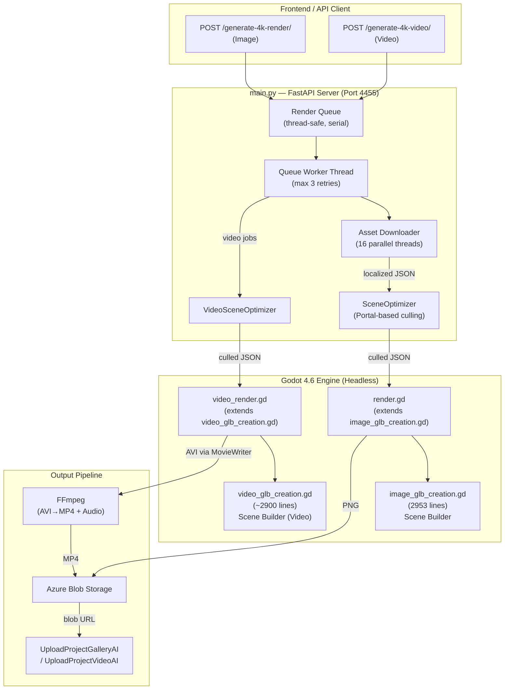
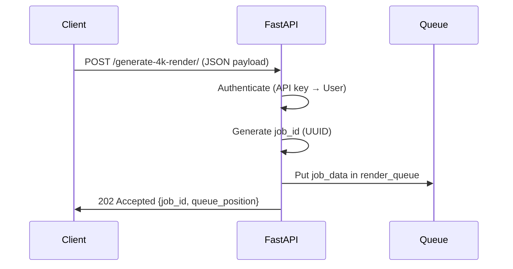
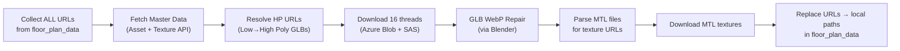

# ZlendoRenderEngine dev4.6 — Full Codebase Analysis

## Overview

This is a **production photorealistic rendering pipeline** that uses a **custom-compiled Godot 4.6 engine** (Forward+ renderer) to generate high-resolution images and videos of architectural interior/exterior scenes. It runs as a **FastAPI web service** (port 4455) that accepts JSON payloads describing floor plans, camera positions, assets, and materials — then renders them headlessly through Godot and uploads the results to Azure Blob Storage.

> [!IMPORTANT]
> The Godot engine binary at `godot/bin/godot.windows.editor.x86_64.console.exe` is a **locally compiled** build from the full Godot 4.6 source code (the entire `godot/` directory is the engine source tree with SConstruct, modules, etc.). This is NOT a standard Godot installation.

---

## Architecture Diagram



---

## Project Structure

| Path | Purpose |
|------|---------|
| [main.py](file:///c:/Zlendo2026/ZlendoRenderEngine%20-%20dev4.6/main.py) | **FastAPI server** (3263 lines) — API endpoints, job queue, asset downloading, Godot invocation, blob upload |
| [scene_optimizer.py](file:///c:/Zlendo2026/ZlendoRenderEngine%20-%20dev4.6/scene_optimizer.py) | **Scene culling** (1879 lines) — Portal-based visibility, FOV-aware room/item/wall culling |
| [scene_optimizer_video.py](file:///c:/Zlendo2026/ZlendoRenderEngine%20-%20dev4.6/scene_optimizer_video.py) | **Video scene culling** — Culls based on full camera path instead of single frame |
| [download_all_assets.py](file:///c:/Zlendo2026/ZlendoRenderEngine%20-%20dev4.6/download_all_assets.py) | Bulk asset pre-downloader |
| [.env](file:///c:/Zlendo2026/ZlendoRenderEngine%20-%20dev4.6/.env) | Environment config (DB, timeouts, API keys, paths) |
| [run_engine_4455.bat](file:///c:/Zlendo2026/ZlendoRenderEngine%20-%20dev4.6/run_engine_4455.bat) | Startup script: activates venv, runs uvicorn on port 4455 |

### Godot Project (`godot_project/`)

| File | Role |
|------|------|
| [main.tscn](file:///c:/Zlendo2026/ZlendoRenderEngine%20-%20dev4.6/godot_project/main.tscn) | Image render scene — root Node3D with `renderer.gd` |
| [video_main.tscn](file:///c:/Zlendo2026/ZlendoRenderEngine%20-%20dev4.6/godot_project/video_main.tscn) | Video render scene — root Node3D with `video_render.gd` |
| [renderer.gd](file:///c:/Zlendo2026/ZlendoRenderEngine%20-%20dev4.6/godot_project/renderer.gd) | Thin loader — loads `render.gd` script at runtime |
| [render.gd](file:///c:/Zlendo2026/ZlendoRenderEngine%20-%20dev4.6/godot_project/render.gd) | **Image entry point** (475 lines) — extends `image_glb_creation.gd`, handles args, camera, resolution, image capture |
| [image_glb_creation.gd](file:///c:/Zlendo2026/ZlendoRenderEngine%20-%20dev4.6/godot_project/image_glb_creation.gd) | **Core scene builder** (2953 lines) — builds architecture, lighting, materials, assets |
| [video_render.gd](file:///c:/Zlendo2026/ZlendoRenderEngine%20-%20dev4.6/godot_project/video_render.gd) | **Video entry point** (897 lines) — extends `video_glb_creation.gd`, MovieWriter integration, keyframe animation |
| [video_glb_creation.gd](file:///c:/Zlendo2026/ZlendoRenderEngine%20-%20dev4.6/godot_project/video_glb_creation.gd) | Video scene builder (mirrors image version with video-specific lighting) |
| [day.exr](file:///c:/Zlendo2026/ZlendoRenderEngine%20-%20dev4.6/godot_project/day.exr) | HDR sky environment (201 MB) for day/sunset renders |
| [night.exr](file:///c:/Zlendo2026/ZlendoRenderEngine%20-%20dev4.6/godot_project/night.exr) | HDR sky environment (27 MB) for night renders |
| [project.godot](file:///c:/Zlendo2026/ZlendoRenderEngine%20-%20dev4.6/godot_project/project.godot) | Godot project config — Forward+ renderer, MSAA, TAA, FXAA, debanding |

### App Framework (`app/`)

| Path | Purpose |
|------|---------|
| `app/routers/auth.py` | Authentication router (API key validation) |
| `app/services/auth_service.py` | API key → User lookup from MySQL DB |
| `app/services/render_logger.py` | Per-job structured logging (timing, assets, status updates) |
| `app/database/models.py` | SQLAlchemy ORM models |
| `app/database/session.py` | MySQL database session (database: `4k_render`) |

### Supporting Files

| Path | Purpose |
|------|---------|
| `godot/` | Full Godot 4.6 engine source (compiled locally) |
| `godot/bin/godot.windows.editor.x86_64.console.exe` | **Console Godot binary** (298 KB stub → loads main 167 MB exe) |
| `ffmpeg/` | Local FFmpeg installation for video encoding |
| `audio/` | Background audio (audio.mp3) mixed into rendered videos |
| `asset_downloads/` | Cache directory for downloaded GLB/OBJ/texture files |
| `output_renders/` | Rendered images and videos |
| `output_glb/` | Intermediate GLB files |
| `culling_logs/` | Scene optimizer debug logs |
| `failed_inputs/` | Saved JSON + error for failed jobs (debugging) |

---

## Complete Rendering Pipeline Workflow

### Phase 1: API Request Intake



1. Client sends `GenerationPayload` with: `floor_plan_data` (JSON string), `threejs_camera`/`blender_camera`, `directional_light`, `render_quality` (HD→12K), `aspect_ratio`
2. API key authenticated via `X-API-Key` header → MySQL user lookup
3. Job added to `render_queue` (Python `queue.Queue`) — **serial execution, one job at a time**

### Phase 2: Background Processing (Queue Worker)

The `render_queue_worker()` thread picks jobs and has a **3-attempt retry pipeline**:
- Attempts 1-2: Silent retry on failure (no error status sent to API)
- Attempt 3 (final): Sends error status + saves failed input to `failed_inputs/`

### Phase 3: Asset Download & Localization



Key details:
- **Master Data API** at `216.48.182.24:4050` provides asset catalog with low/medium/high poly GLB URLs
- Always prefers **High Poly** GLBs for maximum quality
- Downloads cached in `asset_downloads/` with URL→path mapping in `asset_url_map.json`
- GLBs containing `EXT_texture_webp` are **repaired** via Blender (strips WebP textures)
- Configurable timeout: `ASSET_DOWNLOAD_TIMEOUT_SECONDS=300`

### Phase 4: Scene Optimization (Culling)

The `SceneOptimizer` performs **portal-based precision culling** before Godot receives the data:

1. **Determine camera room** — which area polygon contains the camera position
2. **Determine render mode** — INTERIOR (camera inside room) vs EXTERIOR (camera outside)
3. **Interior culling**:
   - Active room always kept
   - Portal sweep: only rooms visible through doors/windows in the camera's FOV cone are kept
   - Walls outside FOV+20° margin are removed
   - Items outside FOV+15° or beyond 45m range are removed
   - Exterior-only items (roof, balcony, tree, etc.) are removed in interior mode
   - Elevation assets are NEVER removed
4. **Ceiling visibility logic**:
   - `use_showall=False` forces ALL ceilings visible (overrides camera-height checks)
   - Single-floor mode hides ceilings above camera

### Phase 5: Godot Rendering

#### Image Rendering (`render.gd` → `image_glb_creation.gd`)

```
godot.exe --path godot_project res://main.tscn -- input.json output.png
```

The Godot process:
1. **`_ready()`** in `render.gd` parses arguments, calls `set_resolution()`, `build_scene()`, `setup_camera()`
2. **`build_scene()`** orchestrates: `setup_lighting()` → `build_architecture()` → `build_structures()` → `load_assets()`
3. **`render_image()`** (deferred): waits 2 frames, places smart point lights, captures viewport image (6 retries), saves PNG + WebP thumbnail

#### Video Rendering (`video_render.gd` → `video_glb_creation.gd`)

```
godot.exe --path godot_project --write-movie output.avi --fixed-fps 30 res://video_main.tscn -- input.json output.png
```

Uses Godot's **MovieWriter** for frame-perfect recording:
1. Scene built identically to image mode
2. Fixed room lights placed at polygon centroids (no per-frame repositioning)  
3. `_process()` applies keyframes each tick — MovieWriter captures automatically
4. Anti-aliasing: **MSAA 8X only** (TAA disabled — causes ghosting on moving camera)
5. Fallback: PNG frame-by-frame if MovieWriter unavailable

### Phase 6: Post-Processing & Upload

1. **Video**: AVI → MP4 via FFmpeg (libx264, CRF 18) + optional audio track from `audio/audio.mp3`
2. **Upload to Azure Blob Storage**: PUT request with SAS token → `render-images/` or `render-videos/` container
3. **Status update to client API**: `UploadProjectGalleryAI` / `UploadProjectVideoAI` with blob URL
4. PNG frames cleaned up after successful MP4 encoding

---

## Scene Construction Deep-Dive (`image_glb_creation.gd`)

### Lighting System

Three lighting profiles with full parameter sets:

| Parameter | Day | Sunset | Night |
|-----------|-----|--------|-------|
| Sky EXR | `day.exr` | `day.exr` | `night.exr` |
| Dir Light Energy | 1.0 | 1.65 | 0.06 |
| Dir Light Color | Warm white | Orange | Cool blue |
| Ambient Energy | 0.15 | 0.28 | 0.05 |
| Tonemap Exposure | 0.72 | 0.78 | 0.45 |
| Sun Elevation | 35° | 8° | 55° |

Lighting components:
- **DirectionalLight3D** ("Sun") — oriented from window positions, 4-split shadows
- **OmniLight3D** (window simulation) — placed at room center near ceiling
- **Fill lights** — overhead + front/back symmetric fills (no camera-direction bias)
- **Smart point lights** (image only) — 5 physics-raycasted lights around camera
- **ReflectionProbe** — interior mode, box projection, shadow-enabled, sized to room

Environment features:
- Filmic tonemapping
- SSAO (radius 1.0, intensity 0.45)
- Glow/bloom (soft light blend)
- Colour grading (contrast 1.06, saturation 1.10)
- SDFGI, SSIL, SSR all **disabled** (crash or produce artifacts in headless mode)

### Architecture Building

The floor plan JSON has a hierarchical structure: `layers → lines (walls) → holes (doors/windows) → areas (rooms)`

1. **Walls** — `CSGBox3D` inside `CSGCombiner3D`, with corner-fill extension
   - Inner/outer facing determined by polygon point-in-polygon test (mirrors frontend `Wall3D.tsx`)
   - INTERIOR mode: structural wall gets inner material + dual 3mm overlay panels (inner + outer)
   - EXTERIOR mode: structural wall gets outer material with `CULL_DISABLED`

2. **Holes** (doors/windows):
   - CSG subtraction from structural wall + overlay panels
   - GLB asset loaded via `GLTFDocument`, scaled to fit hole dimensions
   - Smart shadow control: frame meshes cast shadows, glass panes don't
   - Window positions collected for directional light orientation

3. **Floors/Ceilings** — `CSGPolygon3D` with MODE_DEPTH from area vertex polygons
   - Polygons expanded outward by half wall thickness (seamless joins)
   - Floor materials get low roughness (0.35) + specular (0.6) for reflections
   - Ceiling visibility: complex rules based on `showAllFloors`, `use_showall`, camera height

4. **Structures** — procedural meshes for columns, beams, ramps, stairs, false ceilings, floor openings

### Material System

The `create_material()` function handles:
- Albedo textures from local file paths (downloaded from Azure)
- Normal maps, roughness maps
- Hex color parsing (CSS-style `#RRGGBB`)
- UV scaling with `uv1_scale` from texture repeat data
- Fallback: solid color when no texture available

### Asset Loading

GLB/OBJ assets loaded via `GLTFDocument.append_from_file()`:
- Positioned using floor plan coordinates (cm → meters, `* 0.01`)
- Rotation from JSON degrees → Godot radians
- Optional flip on X/Z axes
- AABB-based auto-scaling when target dimensions differ from model

---

## Render Quality Tiers

| Quality | Resolution | Use Case |
|---------|-----------|----------|
| HD | 1280×720 | Fast preview |
| Full HD | 1920×1080 | Standard |
| 2K | 2560×1440 | High quality |
| 4K | 3840×2160 | Production |
| 6K | 6144×3321 | Large format |
| 8K | 7680×4320 | Ultra |
| 12K | 12288×6642 | Maximum |

Anti-aliasing stack (images): **MSAA 4X + FXAA + TAA + Debanding + LOD 0**
Anti-aliasing stack (videos): **MSAA 8X + Debanding + LOD 0** (no TAA/FXAA — causes motion blur/smear)

---

## API Endpoints Summary

| Method | Path | Auth | Purpose |
|--------|------|------|---------|
| `GET` | `/` | No | Health check |
| `POST` | `/generate-4k-render/` | API Key | Queue image render job |
| `POST` | `/generate-4k-video/` | API Key | Queue video render job |
| `POST` | `/generate-glb-with-camera/` | API Key | Generate preview GLB |
| `POST` | `/api/cancel-job/{job_id}` | No | Cancel queued/processing job |
| `GET` | `/logs/{job_id}` | No | Retrieve render log JSON |
| `GET` | `/queue-status` | No | Monitoring endpoint (via `api_status.py`) |
| `POST` | `/auth/*` | Varies | Authentication routes |

---

## Key Design Decisions

1. **Serial job processing** — Only one Godot instance runs at a time (GPU contention prevention)
2. **3-retry pipeline** — Silent retries before reporting failure to client
3. **Portal-based culling** — Dramatically reduces scene complexity by only building rooms visible through doorways in the camera FOV
4. **High-poly only** — Master data API always resolves to highest quality GLB assets
5. **Headless but NOT --headless** — Godot runs with a window (minimized) because `--headless` disables the rendering pipeline entirely in Godot 4.x
6. **WebP GLB repair** — Godot 4.6 doesn't natively support WebP textures in GLBs; a Blender subprocess strips them
7. **MovieWriter for video** — Frame-perfect capture instead of manual PNG saving; produces AVI then FFmpeg converts to MP4
8. **`use_showall=False`** — Forces all ceilings visible regardless of camera height (prevents ceiling disappearance bugs)

---

## Configuration via `.env`

| Variable | Default | Purpose |
|----------|---------|---------|
| `ASSET_DOWNLOAD_TIMEOUT_SECONDS` | 300 | Total asset download timeout |
| `ASSET_INDIVIDUAL_TIMEOUT_SECONDS` | 150 | Per-asset download timeout |
| `GLB_CREATION_TIMEOUT_SECONDS` | 900 | GLB build timeout |
| `IMAGE_RENDER_TIMEOUT_SECONDS` | 1800 | Image render timeout |
| `VIDEO_RENDER_TIMEOUT_SECONDS` | 1800 | Video render timeout |
| `TOTAL_JOB_TIMEOUT_SECONDS` | 3600 | Overall job timeout |
| `DELETE_INTERMEDIATE_FILES` | true | Clean up temp files |
| `ASSETS_DETAIL_PRINT` | false | Verbose asset download logging |
| `DATABASE_URL` | mysql://...localhost:3306/4k_render | MySQL connection |
